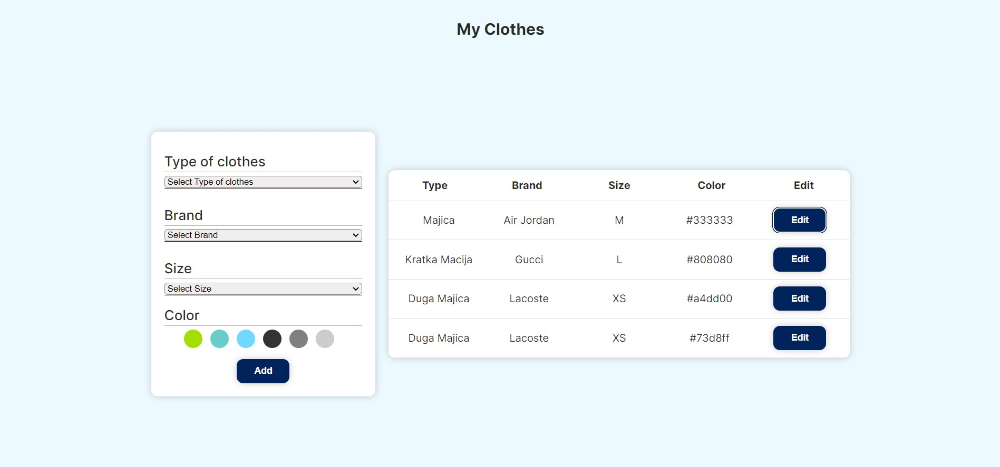
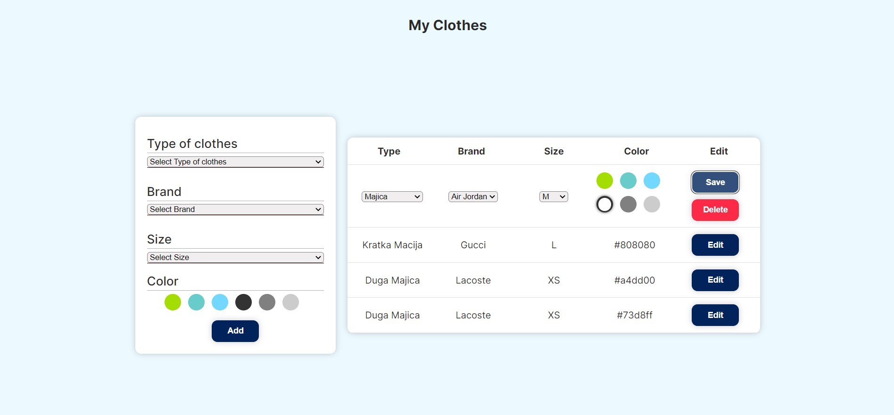

In March 2023 I attended a 2-month long React education at [Digitalna Dalmacija](https://digitalnadalmacija.hr/). The education lasted for 8 weeks, and every week I was required to build a new project. This is the project I built in the 5th week. It was the last "small" app that I built. The next week I started working on a final project in which I utilized all the React concepts I learned.

## Table of contents

- [Challenge](#challenge)
- [Screenshot](#screenshot)
- [Built with](#built-with)
- [What I learned](#what-i-learned)

### Challenge

The task was to build a React app that stores all the information about different clothing items in a wardrobe. The user can see and edit all the existing items or add new ones. All the data is stored in a local JSON server.

### Screenshot

### Built with

- [React](https://reactjs.org/)
- Local JSON server

### What I learned

I learned how to fetch, add or update data in a database while making sure that the component state is updated accordingly.
